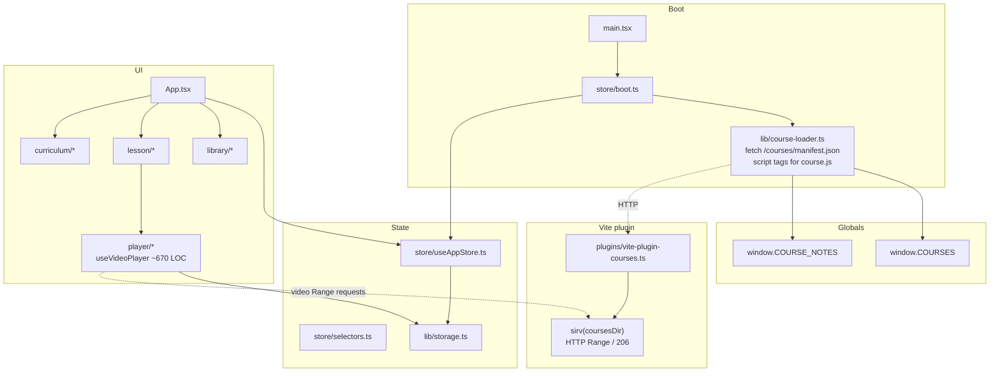

# CourseDesk — Clean-code refactor after React migration

| Field | Value |
|-------|--------|
| **Document** | Design: clean-code cleanup (delete dead code, structure, sirv) |
| **Status** | Implemented |
| **Date** | 2026-08-08 |
| **Codebase** | `/Users/karthic/Projects/coursedesk` |
| **Related** | `AGENTS.md`, `docs/migration-react-tailwind.md`, `plugins/vite-plugin-courses.ts` |
| **Stack** | Vite 6 · React 19 · TypeScript · Zustand · Tailwind v4 · lucide-react · marked · highlight.js · sirv |

---

## Overview

CourseDesk has finished its vanilla → React migration. The app works and is small (~4.9k LOC under `src/`, of which ~2k is CSS). This design proposes a **low-risk clean-code pass**: delete dead code, remove confusing **cross-layer re-exports** from `useAppStore`, clarify module boundaries, decide **sirv** explicitly, and lightly structure the video player without redesigning UX or progress keys.

**Policy:** incremental PRs, no big-bang rewrite, no feature or visual redesign, no localStorage key changes.

---

## Background & Motivation

### Verified current state (post-migration)

| Layer | Today |
|-------|--------|
| Entry | `src/main.tsx` → `bootCourses()` + `<App />` |
| UI | Feature folders under `src/components/{curriculum,layout,lesson,library,player}/` |
| State | Zustand `useAppStore` (~279 LOC) + `selectors.ts` + `boot.ts` |
| Domain helpers | `src/lib/{assets,course-loader,format,notes,storage}.ts` |
| Styling | `styles.css` (~1970 LOC semantic CSS) + Tailwind v4 token bridge in `index.css` (almost no utility classes in components) |
| Courses infra | `plugins/vite-plugin-courses.ts` — live `manifest.json` + **sirv** on `/courses` |
| Tests | `src/__tests__/{format,storage}.test.ts` |
| Approx sizes | `useVideoPlayer.ts` ~670 · `useAppStore` ~279 · `styles.css` ~1970 · `src` total ~4908 LOC |

### Architecture today



### Why clean now

1. Migration left **scaffolding** (local empty `styles/islands/`, cross-layer re-exports on the store module, a dead helper, a no-op in `selectLesson`).
2. **Import confusion:** some UI imports `resolveCourseAsset` / helpers from `useAppStore`; others from `lib/assets` — same symbols, two homes. There is no `store/index.ts` barrel; the confusion is re-exports at the bottom of `useAppStore.ts` (≈L271–279) plus co-located pure helpers.
3. **sirv** is a real dependency with a real job (video seek); the team should decide keep vs replace once, with Range as the hard requirement.
4. Player hook is large but cohesive; a **shallow** split improves navigation without architecture theatre.
5. Tailwind is wired but unused for layout — decide scope so juniors are not told to “rewrite CSS in Tailwind.”

### Hard constraints (from `AGENTS.md`)

- Course details only in `courses/<id>/` — never hardcode course ids in app source.
- Stable lesson `id`s (progress keys).
- No `file://` usage.
- Course packages load via **classic script tags** (`window.COURSES`) — never `import()` course.js.
- `storage.ts` is the **only** writer of `coursedesk.*` localStorage keys.

---

## Goals & Non-Goals

### Goals

1. **Delete** dead exports and no-ops; avoid reintroducing empty local scaffolding.
2. **Simplify** folder structure (clear target tree; no radical move of working code).
3. **sirv decision:** keep, replace, or alternative — justified by video Range (206) for large mp4 seek.
4. **Clean code:** clear domain vs UI vs infra boundaries; reduce store surface; consistent naming; no cross-layer re-exports from the store module.
5. **Maintainability:** junior-friendly layout; short files where natural splits exist.
6. **Incremental PR plan** — each PR mergeable and testable alone.

### Non-goals

- Feature redesign or visual redesign.
- New routing, backend, auth.
- Rewriting course packages or the course contract.
- Full Tailwind rewrite of `styles.css`.
- Breaking localStorage progress / renaming keys.
- Redesigning player UX or keyboard map.
- Moving `courses/` into `public/` or bundling videos.

---

## Proposed Design

### 1. Inventory — delete / keep / move

| Path | Action | Rationale |
|------|--------|-----------|
| `src/styles/islands/` | **Optional local `rmdir` only** | Empty dir on disk; **not git-tracked** (`git ls-files` has only `index.css` + `styles.css`). Git never stores empty dirs without a placeholder, so “delete islands” produces **no commit diff**. Do not treat as PR 1 durable scope — just avoid reintroducing it. |
| `src/store/useAppStore.ts` re-exports of `lib/*` (≈L271–279) | **Delete re-exports** | Cross-layer re-exports confuse “store vs domain”; consumers already import most helpers from `lib/`. (Not an `index.ts` barrel — the re-exports live on the store module file itself.) |
| `finishedSet()` in `useAppStore.ts` | **Delete** (always) | Zero call sites (definition only at ≈L260–262). No move path exists. |
| `void activeLessonId` + unused binding in `selectLesson` | **Delete binding entirely** | Dead no-op; outdated comment. Change `const { activeCourse, lessonsById, activeLessonId } = get()` → `const { activeCourse, lessonsById } = get()` and remove the void line + comment. Player persists via `getState()` / effect deps, not the previous id from `selectLesson`. |
| Unused imports in `useAppStore` (`buildAvailableCourses`, `categoryTitle`, `lectureTypeLabel`, `lessonDurationSeconds`, `resolveCourseAsset`, `sumLessonDurations`, `loadCourses`) | **Delete** | Only used for re-export today. |
| `isLessonFinished` | **Move to `store/selectors.ts`** | Progress vocabulary (see § Decision: `isLessonFinished` home). |
| `docs/migration-react-tailwind.md` | **Keep** (mark **Completed / historical**) | Valuable history; do not delete. Optional later: `docs/archive/`. |
| `docs/clean-code-refactor.md` | **Add** (this doc) | In-tree plan for the cleanup. |
| `src/styles/styles.css` | **Keep** as primary shell | ~1970 LOC, feature-complete; Tailwind rewrite is non-goal. |
| `src/styles/index.css` | **Keep** | Tailwind import + `@theme` token bridge. |
| `sirv` package | **Keep** (move to `devDependencies`) | Node-only middleware; not in client bundle. See § sirv. |
| `useVideoPlayer.ts` | **Keep behavior**; optional **extract** pure helpers | See § Player. |
| `selectProgressStats` + `useShallow` in `ProgressPill` | **Keep pattern** | Required to avoid React 19 infinite `getSnapshot` loop when selector returns a new object. |
| Course packages / `course-template/` | **Do not touch** | Outside refactor scope. |

#### Dead / confusing export map (store)

```text
useAppStore.ts today exports:
  useAppStore, AppStore, AppView, SidebarTab     ← keep
  finishedSet                                      ← DELETE always (unused; no move)
  isLessonFinished                                 ← MOVE to store/selectors.ts
  categoryTitle, lectureTypeLabel, … (re-exports) ← DELETE; import from lib/assets | course-loader
```

Call sites to fix when removing re-exports:

| File | Currently from store | After |
|------|----------------------|--------|
| `VideoPlayer.tsx` | `resolveCourseAsset` | `lib/assets` |
| `FilesPanel.tsx` | `resolveCourseAsset` | `lib/assets` |
| `LessonButton.tsx` | `isLessonFinished` | `store/selectors` |
| `CategorySection.tsx` | `isLessonFinished` | `store/selectors` |
| `LectureBar.tsx` | `isLessonFinished` | `store/selectors` |

(Helpers already imported from `lib/` in most other files — keep that style for paths/durations/labels.)

#### Decision: `isLessonFinished` home (closed)

| Choice | Verdict |
|--------|---------|
| **`store/selectors.ts` (chosen)** | Progress vocabulary lives here already (`selectProgressStats` builds a `Set` from `completedLessonIds`). A 3-line pure helper fits next to that. Keeps `useAppStore` limited to state/actions/types after cleanup. |
| `lib/assets.ts` | Paths/durations/labels/registry — not completion semantics. Rejected to avoid a second move later. |

**Export shape after PR 2:**

```ts
// store/selectors.ts
export function isLessonFinished(
  completedLessonIds: string[],
  lessonId: string
): boolean {
  return completedLessonIds.includes(lessonId);
}
```

Consumers: `import { isLessonFinished } from "../../store/selectors"` (alongside `selectProgressStats` / `progressAriaLabel` where relevant).

### 2. Target folder structure

**Principle:** the current feature-folder layout is already good. Prefer **delete and straighten imports** over renaming half the tree. Only rename when it reduces ambiguity.

#### Before (current)

```text
src/
  App.tsx, main.tsx
  components/
    curriculum/   CategorySection, CurriculumSidebar, FilesPanel, LessonButton
    layout/       ProgressPill, Topbar
    lesson/       LectureBar, LessonView, NotesPanel
    library/      CourseCard, CourseLibrary
    player/       PlayerControls, PlayerHud, useVideoPlayer, VideoPlayer
  lib/
    assets.ts, course-loader.ts, format.ts, notes.ts, storage.ts
  store/
    boot.ts, selectors.ts, useAppStore.ts
  styles/
    index.css, styles.css
    islands/   ← empty, untracked local only (optional rmdir)
  types/course.ts
  __tests__/
plugins/vite-plugin-courses.ts
docs/migration-react-tailwind.md
```

#### After (target)

```text
src/
  App.tsx                         # shell + app-level hotkeys ([ ] F)
  main.tsx                        # StrictMode + bootCourses + CSS entry
  components/
    curriculum/                   # unchanged roles
    layout/
    lesson/
    library/
    player/
      VideoPlayer.tsx
      PlayerControls.tsx
      PlayerHud.tsx
      useVideoPlayer.ts           # orchestration + media/keyboard effects;
                                  # re-exports types/constants for stable paths (PR 4)
      fullscreen.ts               # NEW (optional PR): browser FS helpers
      playerTypes.ts              # NEW (optional PR): HudKey, PlayerUiState, constants
                                  # — consumers may still import via useVideoPlayer
  lib/
    assets.ts                     # paths, durations, lecture labels, buildAvailableCourses
    course-loader.ts              # manifest + script-tag load (infra-ish, stays in lib)
    format.ts                     # pure time/label formatters
    notes.ts                      # marked + hljs render into DOM
    storage.ts                    # sole coursedesk.* writer
  store/
    boot.ts
    selectors.ts                  # selectProgressStats, progressAriaLabel, isLessonFinished
    useAppStore.ts                # state + actions ONLY — no lib re-exports
  styles/
    index.css
    styles.css                    # no islands/ on disk; do not reintroduce
  types/course.ts
  vite-env.d.ts                   # Window.COURSES / COURSE_NOTES
  __tests__/
plugins/
  vite-plugin-courses.ts          # still uses sirv
docs/
  migration-react-tailwind.md     # historical
  clean-code-refactor.md          # this design
```

**Not doing (rejected for complexity):**

- `src/domain/` + `src/infra/` split — overkill at ~3k TS LOC.
- Moving components next to CSS modules — shell CSS is global by design.
- Colocating tests under each feature folder — fine later; not required now.

### 3. sirv analysis & recommendation

#### Why sirv is here

`plugins/vite-plugin-courses.ts` mounts static files from disk:

```ts
// plugins/vite-plugin-courses.ts
server.middlewares.use(
  "/courses",
  sirv(coursesDir, { dev: true, etag: true, single: false })
);
```

Course packages live in **`courses/`** (gitignored, often large mp4 libraries). They are **not** under Vite `publicDir` (`public/`), so Vite’s built-in static middleware does **not** serve them. The plugin also serves live `/courses/manifest.json` for discovery.

#### Video seek requirement

HTML5 `<video>` seeking on large mp4s issues **HTTP Range** requests. The server must respond with:

- `Accept-Ranges: bytes`
- `206 Partial Content` + `Content-Range` for ranged GETs

**Verified:** sirv implements this (see `node_modules/sirv/build.mjs` — Range header parse, status 206, `Content-Range` / `Accept-Ranges`).

Without Range support, common failure modes:

- Seek bar jumps then rebuffers from 0 or stalls.
- Resume-from-saved-position is slow or broken on large files.
- Some browsers refuse efficient progressive download.

#### Can Vite alone replace sirv?

| Approach | Range? | Fit for CourseDesk? |
|----------|--------|---------------------|
| Put courses under `public/` | Yes (Vite static uses Range-capable serving) | **No** — courses are huge, gitignored, multi-package; pollutes public; loses clean `courses/<id>` contract. |
| `server.fs.allow` only | N/A | **No** — allows Vite to *read* files for transforms; does not mount `/courses/*` as static. |
| Custom middleware with `fs.createReadStream` + manual Range | Yes if implemented correctly | Possible but reimplements sirv; more code, more bugs. |
| **sirv on `/courses`** (current) | **Yes** | **Best fit** — tiny, battle-tested, used only in Node plugin. |
| Drop middleware; use absolute `file://` | No (blocked) | Forbidden by product rules. |

Note: Vite **depends on / embeds** Range-capable static serving for its own assets, but that is **not** a public API for mounting an arbitrary directory at `/courses`. CourseDesk correctly uses an explicit plugin.

#### Dependency hygiene

- sirv is **Node-only** (Vite plugin). It does **not** ship in the browser bundle.
- Today it is listed under **`dependencies`** in `package.json` — incorrect for a server middleware.
- **`pnpm why sirv`** shows only CourseDesk as the direct consumer (Vite may list/bundled-use sirv separately; our app should not rely on that).
- Moving sirv to `devDependencies` is **consistent with existing tooling**: `vite` (and the courses plugin) already live as dev tooling. A pure `pnpm install --prod` environment never ran the courses plugin successfully without vite either — so the field move is hygiene, not a new runtime constraint.

#### Recommendation

| Decision | Detail |
|----------|--------|
| **Keep sirv** | Continues to own Range for `/courses/*`. |
| **Move to `devDependencies`** | Plugin is build/dev/preview tooling, not runtime UI; matches `vite` placement. |
| **Do not rewrite a custom Range server** | ~5KB specialized lib vs 40–80 LOC of fragile stream/header code. |
| **Do not move courses into `public/`** | Violates package layout and scales poorly. |
| **Document in plugin header** | One-line comment already exists; strengthen README “why sirv” if needed. |

```mermaid
flowchart LR
  video["browser video element"] -->|"GET /courses/id/videos/x.mp4\nRange: bytes=…"|| mw
  mw["Vite middleware stack"]
  mw --> manifest["manifest.json handler"]
  mw --> sirv["sirv(coursesDir)"]
  sirv -->|"206 + Content-Range"| video
```

**Risk if removed without replacement:** **Severity: High** — video seek/resume regressions on real course libraries (100+ multi‑100MB mp4s).

**Mitigation if ever replacing:** automated check in manual QA checklist — open long video, seek to 50%, hard refresh, confirm resume; verify Network tab shows 206.

### 4. Module boundaries

```text
┌────────────────────────────────────────────────────────────┐
│  UI  (src/components, App.tsx)                             │
│  - Presentational + local UI state                         │
│  - Subscribe to store with narrow selectors                │
│  - Call store actions; never write localStorage directly   │
│    except VideoPlayer persist path via storage.ts          │
└───────────────────────────┬────────────────────────────────┘
                            │
┌───────────────────────────▼────────────────────────────────┐
│  App state  (src/store)                                    │
│  - useAppStore: course session, theme, sidebar, actions    │
│  - selectors: ProgressStats, isLessonFinished, aria labels │
│  - boot: single-flight course load + hydrate               │
│  - NO cross-layer re-exports of lib/* helpers              │
└───────────────────────────┬────────────────────────────────┘
                            │
┌───────────────────────────▼────────────────────────────────┐
│  Domain / shared  (src/lib, src/types)                     │
│  - types/course.ts     package contract shapes             │
│  - assets.ts           paths, durations, labels, registry  │
│  - format.ts           pure formatters                     │
│  - notes.ts            markdown → DOM                      │
│  - storage.ts          ONLY writer of coursedesk.* keys    │
│  - course-loader.ts    discovery + script-tag load         │
└───────────────────────────┬────────────────────────────────┘
                            │
┌───────────────────────────▼────────────────────────────────┐
│  Infra  (plugins/, Vite)                                   │
│  - vite-plugin-courses: manifest + sirv static /courses    │
│  - Not imported by React components                        │
└────────────────────────────────────────────────────────────┘
```

**Exception (documented):** `VideoPlayer` calls `Storage.saveLessonTime` / `loadLessonTime` directly so the player hook stays free of Zustand. That is intentional and already the pattern — keep it; do not force all storage through the store.

**Rule of thumb for juniors:**

| Need | Import from |
|------|-------------|
| React state / actions | `store/useAppStore` |
| Progress math / `isLessonFinished` | `store/selectors` |
| Paths, durations, labels | `lib/assets` |
| Time strings | `lib/format` |
| Progress persistence | `lib/storage` |
| Markdown notes | `lib/notes` |
| Boot only | `store/boot` (from `main.tsx` only) |

### 5. Specific simplification opportunities

#### 5.1 Store (`useAppStore.ts`)

| Item | Action |
|------|--------|
| Re-export block (lines ~271–279) | Remove entirely |
| `finishedSet` | **Always delete** (no move) |
| `isLessonFinished` | **Move to `store/selectors.ts`** |
| `selectLesson` | Drop unused `activeLessonId` from `get()` destructure; delete `void activeLessonId` + outdated comment |
| State shape | Keep as-is (view, active course, lessons, completed ids, UI chrome) — not bloated for this app |
| `emptyCourseSlice()` | Keep — good reset helper for `showLibrary` |

`selectLesson` after cleanup (behavior unchanged):

```ts
selectLesson: (lessonId) => {
  const { activeCourse, lessonsById } = get();
  if (!activeCourse) return;
  const lesson = lessonsById[lessonId];
  if (!lesson) return;

  Storage.saveLastLessonId(activeCourse.data.id, lessonId);
  Storage.saveOpenCategoryId(activeCourse.data.id, lesson.categoryId);

  set({
    activeLessonId: lessonId,
    openCategoryId: lesson.categoryId,
  });
},
```

Optional later (not required): split `theme` + sidebar chrome into a tiny slice — **reject for now** (one store is fine at this size).

#### 5.2 Selectors & `useShallow`

```tsx
// ProgressPill.tsx — KEEP this pattern
const stats = useAppStore(useShallow(selectProgressStats));
```

**Convention going forward:**

- Prefer **multiple single-field** `useAppStore((s) => s.x)` hooks (already used widely) — simple and fine with Zustand.
- When a selector returns a **new object/array** each call, wrap with `useShallow` (or select primitives only).
- Do not introduce a global `useAppStore()` without selector.

#### 5.3 Player (`useVideoPlayer.ts` ~670 LOC)

Natural seams (extract **pure** modules first; keep one hook as the brain):

| Extract | Contents | Why |
|---------|----------|-----|
| `fullscreen.ts` | `getFullscreenElement`, `requestFullscreen`, `exitFullscreen` (~50 LOC, ≈L59–107 today) | Vendor-prefix noise, no React |
| `playerTypes.ts` (optional) | `SEEK_STEP`, `VOLUME_STEP`, `HUD_MS`, `PERSIST_MS`, `PLAYBACK_RATES`, `HudKey`, `HudState`, `PlayerUiState`, `initialUi` | Shared by Controls + hook |

**Consumer import strategy (PR 4 — required choice):**

Use **(a) re-export from `useVideoPlayer.ts`** so existing import paths stay stable:

```ts
// useVideoPlayer.ts after extract
export { PLAYBACK_RATES, type HudKey, type HudState, type PlayerUiState } from "./playerTypes";
// or re-export constants/types defined in playerTypes / kept local
```

Current external imports that must keep working without a forced multi-file churn:

| Consumer | Imports from `useVideoPlayer` today |
|----------|-------------------------------------|
| `PlayerControls.tsx` | `PLAYBACK_RATES`, `PlayerUiState`, `UseVideoPlayerApi` |
| `PlayerHud.tsx` | `HudKey`, `HudState` |
| `App.tsx` | `isEditableTarget` |

Alternative **(b)** update `PlayerControls` / `PlayerHud` to import from `playerTypes.ts` directly — only if preferred for clarity; then list those path edits in the PR. Prefer **(a)** for a smaller mechanical PR.

**Explicitly out of PR 4 move set:**

- **`isEditableTarget`** — leave in `useVideoPlayer.ts` (or a tiny shared util only if needed later). **Do not** relocate it without updating `App.tsx`. App-level hotkeys (`[` `]` `F`) depend on this import; accidental “cleanup” of the path is a regression risk with no benefit.

**Do not:**

- Introduce a class-based `VideoController`.
- Split keyboard and media listeners into separate hooks unless the main file still feels painful after the pure extracts (~500 LOC hook is acceptable if cohesive).
- Change keyboard map, HUD timing, or persist thresholds.
- Move `isEditableTarget` without an `App.tsx` import update (prefer not moving it).

`VideoPlayer.tsx` stays the thin adapter: store → `src` / resume time → `useVideoPlayer` → controls/HUD.

`useHasActiveVideo` can stay in `VideoPlayer.tsx` or move next to App hotkeys — low priority; **not** part of PR 4.

#### 5.4 Components

| Area | Notes |
|------|--------|
| Multiple `useAppStore` lines per component | **Keep** — clearer than one mega-selector object |
| `CourseCard.cardProgress` | Fine; could share math with `selectProgressStats` later if duplicated logic hurts — currently library reads storage per card intentionally |
| `NotesPanel` | Keep imperative `renderNotesInto` (marked/hljs DOM) — no React markdown rewrite |
| `App.tsx` hotkeys | Keep app-level `[` `]` `F`; player owns media keys; keep `isEditableTarget` import path stable |

#### 5.5 CSS / Tailwind

| Decision | Detail |
|----------|--------|
| **Keep** `styles.css` as the design system | Semantic class names (`.topbar`, `.player-controls`, …) match components |
| **Keep** Tailwind v4 + `@theme` bridge | Already cheap; useful for occasional utilities later |
| **Do not** mass-convert shell CSS to utilities | Non-goal; high churn, high visual risk |
| Safe micro-wins only | Remove truly dead rules if found while touching a section; no drive-by restyle |
| `styles/islands/` | Optional local remove; do not reintroduce empty dirs or placeholder files |

Tailwind utility usage in components today is effectively **zero** — class names are all custom. That is OK.

#### 5.6 Naming consistency

| Prefer | Avoid |
|--------|--------|
| `lib/assets` for `resolveCourseAsset` | Re-export via `useAppStore` |
| `store/selectors` for `isLessonFinished` | Putting completion checks in `lib/assets` |
| `completedLessonIds` (store) | Renaming to `finishedIds` mid-refactor |
| `bootCourses` only from `main.tsx` | Calling boot from components |
| Feature folder names as today | `screens/` / `features/` rename churn |
| “Cross-layer re-exports” | Calling the problem a “barrel file” when there is no `index.ts` |

Optional rename (low priority): `assets.ts` → `course-utils.ts` if “assets” confuses people with static files — **only if** done in a dedicated PR with import path updates.

### 6. Clean-code conventions (going forward)

1. **Single responsibility:** store = session state; selectors = pure derived progress helpers; lib = pure/domain/persistence; plugin = Node HTTP.
2. **No cross-layer re-exports** from `useAppStore` of `lib/*` helpers (`useAppStore` exports state, actions, and related types only).
3. **Delete dead code** rather than commenting it out.
4. **Stable IDs & storage keys** — never rename `coursedesk.*` or lesson ids casually.
5. **Narrow store selectors**; `useShallow` when returning objects.
6. **Script-tag course load** forever for packages — document in `course-loader.ts` header (already present).
7. **Files prefer < ~300 LOC** for UI modules; hooks may be longer if cohesive; extract pure helpers first.
8. **Tests** stay on pure modules (`format`, `storage`); add player unit tests only for pure helpers (e.g. `applyResumeSeconds` already in format).
9. **PR size:** one concern per PR (delete dead → imports → deps → optional player extract).

---

## API / Interface Changes

**Public product API (course packages, localStorage, URLs):** none.

**Internal import API:**

| Before | After |
|--------|--------|
| `import { resolveCourseAsset, useAppStore } from "../../store/useAppStore"` | `import { useAppStore } from "../../store/useAppStore"` + `import { resolveCourseAsset } from "../../lib/assets"` |
| `import { isLessonFinished } from "../../store/useAppStore"` | `import { isLessonFinished } from "../../store/selectors"` |
| `dependencies.sirv` | `devDependencies.sirv` |
| Player consumers importing types/constants from `useVideoPlayer` | **Stable** via re-export (PR 4 strategy a), or explicit path updates listed in that PR |

No changes to:

- `window.COURSES` / `window.COURSE_NOTES`
- `/courses/manifest.json` shape
- `Storage` key names or `CourseRecord` fields
- Player keyboard shortcuts or control layout

---

## Data Model Changes

**None.**

- `types/course.ts` stays the package contract.
- Zustand `AppStore` shape unchanged except removal of unused **exported helpers** (not state fields).
- localStorage schema unchanged.

---

## Alternatives Considered

| Alternative | Pros | Cons | Verdict |
|-------------|------|------|---------|
| **Keep sirv** (recommended) | Tiny, Range-correct, already wired | Extra direct dep (dev-only) | **Choose** |
| Custom Range middleware | One fewer package name | Reimplement bugs; more code to own | Reject unless sirv becomes unmaintained |
| Serve courses via `public/` | Use Vite static only | Bad layout for large gitignored libraries | Reject |
| Full Tailwind rewrite of shell | “Modern” stack purity | Huge PR, visual risk, no user value | Reject (non-goal) |
| Split Zustand into multiple stores | Isolation | Overkill; more wiring for one SPA session | Reject |
| Big-bang folder rename (`domain/`, `features/`) | Textbook clean architecture | Noise diffs, breaks muscle memory | Reject |
| Leave store re-exports of `lib/*` | Zero churn | Ongoing “where do I import?” confusion | Reject |
| Put `isLessonFinished` in `lib/assets` | Fewer store exports | Wrong vocabulary; thrash risk | Reject — use `selectors.ts` |

---

## Security & Privacy Considerations

| Topic | Notes |
|-------|--------|
| localStorage | Still local-only progress; no new keys or cloud sync. |
| Course scripts | `course.js` / `notes.js` remain trusted local files executed as classic scripts — **unchanged** trust model. |
| Path serving | sirv serves only under `coursesDir`; keep `single: false` so SPA fallback does not swallow missing assets. |
| Notes HTML | `marked` output + link `rel=noopener` already; no change. |
| Dependency surface | Moving sirv to devDependencies **reduces** confusion about production client deps; no new runtime packages. |

---

## Observability

No production telemetry today (local app). Keep lightweight diagnostics:

- Plugin boot log: `Courses (N): id1, id2, …` (existing).
- `console.warn` on missing manifest / skipped package (existing).
- `console.error` on boot failure (existing).

Optional QA checklist after plugin/sirv PRs (manual):

1. `pnpm start` → courses list prints.
2. Open course with large mp4 → Network: ranged requests return **206**.
3. Seek mid-video; refresh → resume position restored.
4. `pnpm preview` still serves `/courses` (plugin `configurePreviewServer`).

---

## Rollout Plan

1. Land small delete/import PRs first (zero behavior change).
2. Move sirv to devDependencies; smoke-test seek (206 + preview).
3. Optional player extract PR (stable re-exports).
4. Docs status updates.
5. No feature flag needed — all changes are internal structure.

Rollback: revert single PR; storage and courses untouched.

---

## Open Questions

1. ~~**`isLessonFinished` home**~~ — **Closed:** `store/selectors.ts` (see § Decision: `isLessonFinished` home).

2. **Rename `lib/assets.ts`?** Only if the team finds the name confusing; not required for cleanup success.

3. **Archive migration doc path:** keep at `docs/migration-react-tailwind.md` vs `docs/archive/` — cosmetic.

4. **Tailwind long-term:** keep as token bridge only, or gradually adopt utilities in *new* UI only?  
   **Recommendation:** bridge + optional new utilities; never mandatory rewrite of shell.

5. **Production packaging of courses:** today `vite build` does not copy `courses/` into `dist/`; local play is `pnpm start` / `preview` + plugin. Out of scope unless product wants a “ship courses with dist” mode.

---

## Risks

| Risk | Severity | Mitigation |
|------|----------|------------|
| Removing sirv / breaking Range | **High** | Keep sirv; manual 206 check if middleware changes |
| Import fix misses a path → build fail | Low | `pnpm typecheck` in each PR |
| Player extract regresses keyboard/fullscreen | Medium | Extract pure functions only; re-export for stable imports; leave `isEditableTarget` in place; manual keyboard smoke |
| Accidental localStorage key rename | **High** | Explicit non-goal; code review checklist |
| Touching `styles.css` causes visual drift | Medium | Avoid CSS changes in this refactor |
| `useShallow` removed from ProgressPill | Medium | Document “do not remove”; test library + course views |
| sirv `dependencies` → `devDependencies` field move | **Low** | Consistent with `vite` already in devDependencies; full install still required for start/build/preview; smoke 206 + preview is the real gate |

---

## References

- `AGENTS.md` — product/engineering rules
- `plugins/vite-plugin-courses.ts` — manifest + sirv
- `src/store/useAppStore.ts` — store + current cross-layer re-exports
- `src/store/selectors.ts` — `selectProgressStats` (+ target home for `isLessonFinished`)
- `src/components/layout/ProgressPill.tsx` — `useShallow` fix
- `src/components/player/useVideoPlayer.ts` — player hook
- `src/lib/storage.ts` — sole `coursedesk.*` writer
- `docs/migration-react-tailwind.md` — completed migration design (historical)
- sirv Range implementation: `node_modules/sirv/build.mjs` (206 / Content-Range)

---

## Key Decisions

1. **`src/styles/islands/`** is untracked empty scaffolding — optional local `rmdir`; **not** a durable git PR item. Do not reintroduce empty style islands.
2. **Remove cross-layer re-exports of `lib/*` from `useAppStore`** — import domain helpers from `lib/*`; store module exports state/actions (+ types) only. (Not an `index.ts` barrel — the re-exports are on the store file itself.)
3. **Always delete `finishedSet`** (no move). **Delete `activeLessonId` from the `selectLesson` destructure** along with the `void` no-op and outdated comment.
4. **`isLessonFinished` lives in `store/selectors.ts`** after PR 2 (progress vocabulary; closed open question).
5. **Keep sirv** for `/courses` static + **HTTP Range (206)** video seek; **do not** replace with Vite `public/` or a custom Range server.
6. **Move sirv to `devDependencies`** — Node plugin only; consistent with vite/plugin tooling already in devDependencies. Field-move risk is **low**; 206 + preview smoke is the regression net.
7. **Keep `styles.css` shell + Tailwind token bridge**; no full Tailwind rewrite.
8. **Keep `selectProgressStats` + `useShallow`** in ProgressPill — required correctness pattern.
9. **Player (optional PR 4):** extract `fullscreen.ts` (+ optional `playerTypes.ts`); **re-export** types/constants from `useVideoPlayer.ts` for stable consumer paths; **leave `isEditableTarget` in the hook** (App.tsx depends on it). No UX redesign, no class-based controller.
10. **Folder structure stays feature-based** under `components/`; no domain/infra mega-reorg.
11. **Migration design doc stays** as historical; new design lives at `docs/clean-code-refactor.md`.
12. **No localStorage / course package / lesson id changes.**
13. **Ship as ordered small PRs** (see below), not one rewrite.

---

## PR Plan

Ordered, each independently mergeable and green on `pnpm typecheck` + `pnpm test`.

### PR 1 — Delete dead helpers & `selectLesson` no-op
**Scope:**  
- **Always delete** `finishedSet` from `useAppStore.ts` (definition only; no call sites; no move).  
- In `selectLesson`: change  
  `const { activeCourse, lessonsById, activeLessonId } = get()`  
  → `const { activeCourse, lessonsById } = get()`  
  and **delete** the `void activeLessonId` line + outdated “player persist” comment.  
- Optional local hygiene (no commit expected): `rmdir src/styles/islands` if present. **Do not** add a placeholder file to “track the delete.”  
**Verify:** `pnpm typecheck`, `pnpm test`, smoke open library / select a lesson.  
**Risk:** none (zero behavior change).

### PR 2 — Straighten imports (kill cross-layer re-exports)
**Scope:**  
- Delete re-export block (≈L271–279) and unused imports from `useAppStore.ts`.  
- **Move** `isLessonFinished` to `store/selectors.ts` (fixed home).  
- Update imports:  
  - `VideoPlayer`, `FilesPanel` → `resolveCourseAsset` from `lib/assets`  
  - `LessonButton`, `CategorySection`, `LectureBar` → `isLessonFinished` from `store/selectors`  
**Verify:** typecheck; click lesson, open files link, mark complete / section complete.  
**Risk:** low (compile-time catches misses).

### PR 3 — sirv dependency hygiene + docs note
**Scope:**  
- Move `sirv` from `dependencies` → `devDependencies` in `package.json`.  
- Strengthen comment in `vite-plugin-courses.ts` (why Range / do not remove lightly).  
- One short paragraph in README Structure/Run if helpful.  
**Verify:** `pnpm install`, `pnpm start`, seek large mp4 (206 in Network), `pnpm preview` still serves courses.  
**Risk:** **low** — consistent with `vite` already living in devDependencies; start/build/preview always need a full (non-`--prod`) install. The real regression net is the 206 seek + preview smoke, not the package.json field move.

### PR 4 — Player pure extracts (optional but recommended)
**Scope:**  
- Add `fullscreen.ts` with pure FS helpers (~L59–107 today).  
- Optionally add `playerTypes.ts` for constants/types.  
- **Import strategy (default):** re-export types/constants from `useVideoPlayer.ts` so `PlayerControls` / `PlayerHud` import paths stay stable.  
- **Do not move** `isEditableTarget` (App.tsx imports it from `useVideoPlayer` for app-level hotkeys).  
- `useVideoPlayer.ts` imports extracted modules; **no** behavior change.  
**Verify:** play/pause, seek, mute, fullscreen, speed, keyboard (player keys **and** App `[` `]` `F`), resume position.  
**Risk:** medium — keep diff mechanical; re-exports prevent incomplete consumer updates.

### PR 5 — Docs housecleaning
**Scope:**  
- Mark `docs/migration-react-tailwind.md` status **Completed (historical)** (currently still says Draft while the app is already React).  
- Ensure `docs/clean-code-refactor.md` matches landed decisions (update Key Decisions if PR-4 skipped).  
- Touch `AGENTS.md` only if import rules need a one-liner (“import path/duration helpers from `lib/`; progress helpers from `store/selectors`; not from `useAppStore`”).  
**Verify:** docs only.  
**Risk:** none.

### Explicitly out of PR plan
- Tailwind restyle of shell  
- Multi-store split  
- Course package changes  
- Custom Range middleware experiment  
- Git-tracking empty directories  
- Moving `isEditableTarget` / App hotkey wiring as a “cleanup”  

---

## Appendix A — File size snapshot (pre-refactor)

| Path | LOC |
|------|-----|
| `src/styles/styles.css` | ~1970 |
| `src/components/player/useVideoPlayer.ts` | ~670 |
| `src/store/useAppStore.ts` | ~279 |
| `src/lib/storage.ts` | ~218 |
| `src/components/player/PlayerControls.tsx` | ~137 |
| `plugins/vite-plugin-courses.ts` | ~84 |
| `src` total (ts/tsx/css) | ~4908 |

## Appendix B — What “done” looks like

- [ ] Empty `styles/islands/` not present on disk and not reintroduced (local hygiene; not a git delete commit)
- [ ] No cross-layer re-exports of `lib/*` from `useAppStore`
- [ ] No dead `finishedSet`; `selectLesson` no longer destructures unused `activeLessonId` or uses `void`
- [ ] `isLessonFinished` lives in `store/selectors.ts` and is imported from there
- [ ] sirv in `devDependencies`; video seek still 206
- [ ] Player behavior unchanged; App hotkeys still use `isEditableTarget` from a stable path
- [ ] Progress keys and storage unchanged
- [ ] `pnpm typecheck` && `pnpm test` green
- [ ] Docs updated (migration historical + this design)
