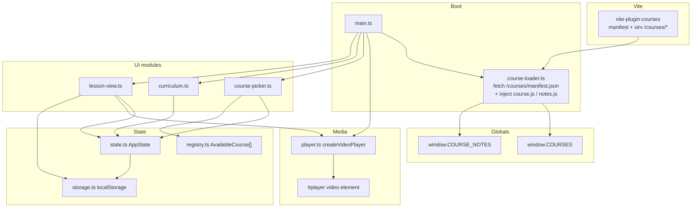
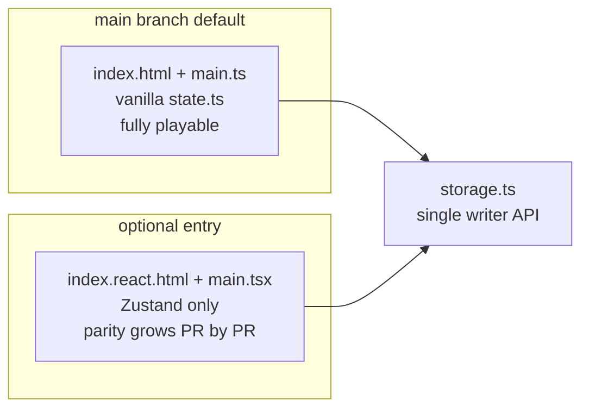
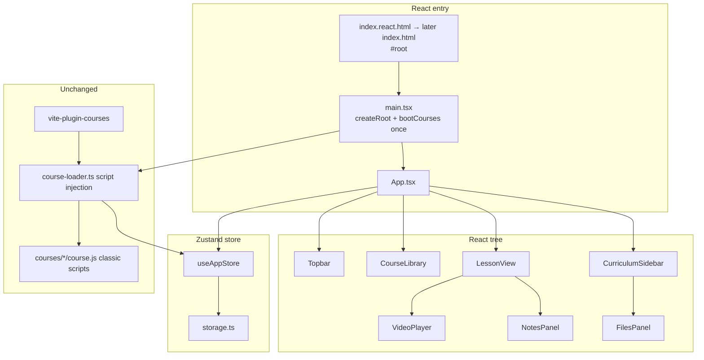
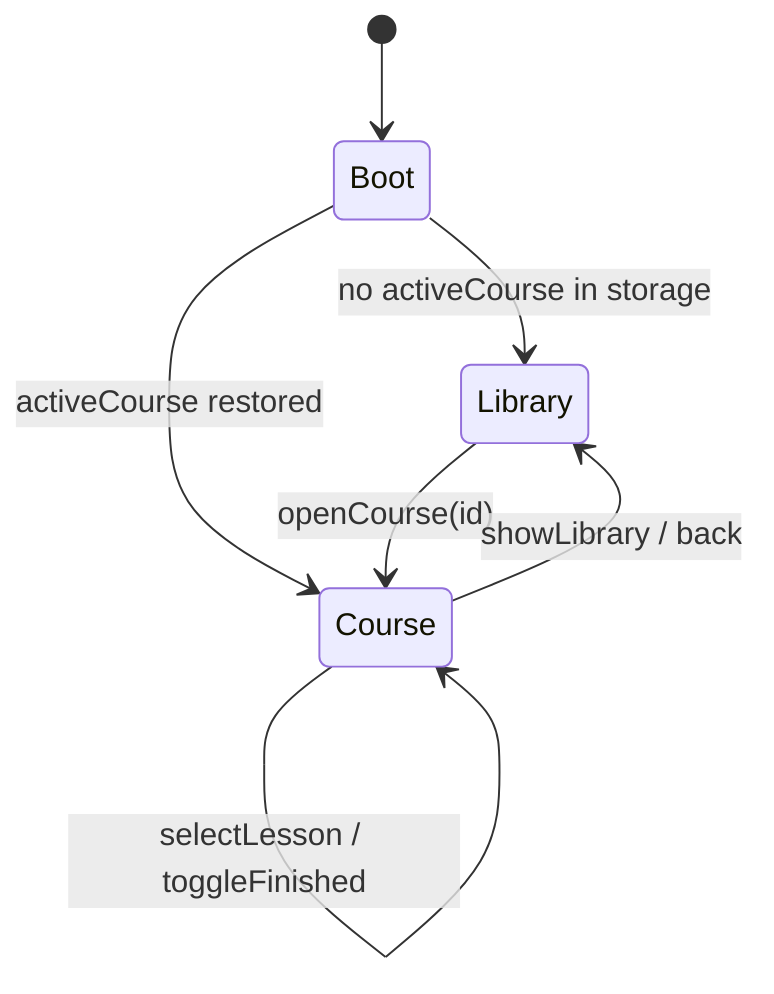
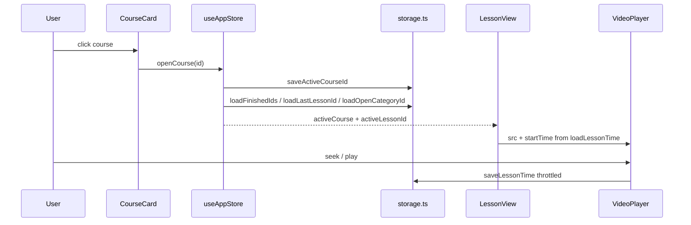
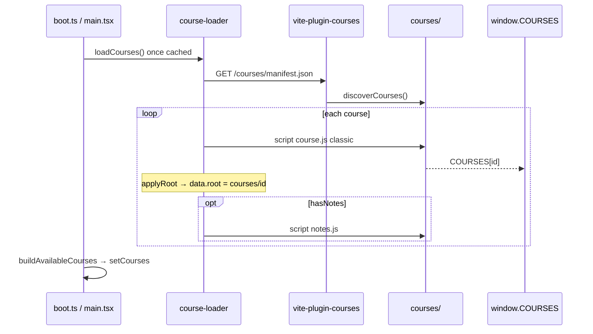
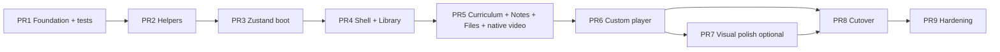

# CourseDesk — Migrate to React + Tailwind

| Field | Value |
|-------|--------|
| **Document** | Design: modern stack migration (React + Tailwind) |
| **Author** | TBD |
| **Date** | 2026-08-08 |
| **Status** | Draft (rev 2 — review feedback addressed) |
| **Codebase** | `/Users/karthic/Projects/coursedesk` |
| **Related** | `AGENTS.md`, `course-template/`, `plugins/vite-plugin-courses.ts` |

---

## Overview

CourseDesk is a local offline course player: Vite + TypeScript, vanilla DOM UI, a single ~2k-line CSS file, and a custom video player. The app is small (~2.4k LOC TS + chrome HTML) but feature-dense—especially the player and progress persistence.

This design proposes an **incremental migration** to **React 19 + TypeScript + Vite + Tailwind CSS v4 + lucide-react + Zustand**, while **keeping the course package contract, Vite courses plugin, localStorage keys, and visual design** intact. The goal is modern component ergonomics and maintainable styling without a risky big-bang rewrite or progress loss for existing users.

**Migration policy (decided):** main always keeps the vanilla entry playable. React is built behind an explicit dual entry until feature parity, then a single cutover PR deletes vanilla. There is **no dual-write** between Zustand and `state.ts`.

---

## Background & Motivation

### Current state (verified)

| Layer | Today |
|-------|--------|
| Package manager | pnpm 11 (`packageManager: pnpm@11.17.0`) |
| Build | Vite 6.3 + TypeScript 5.8, `strict` |
| Entry | `index.html` (~216 lines of chrome) + `src/main.ts` |
| UI | Vanilla TS, imperative DOM via `src/lib/dom.ts` (`el`, `id`, `toggleClass`) |
| Styling | `src/styles/styles.css` (~1970 lines), light/dark via `data-theme` + CSS variables |
| Icons | `lucide` `^1.28.0` (not React) → HTML strings in `src/lib/icons.ts` |
| Markdown | `marked` + `highlight.js` in `src/lib/notes.ts` |
| Courses | Custom plugin `plugins/vite-plugin-courses.ts` + `sirv` (HTTP Range for video seek) |
| State | Module-level mutable `state` in `src/lib/state.ts` + `registry.ts` |
| Persistence | `localStorage` in `src/lib/storage.ts` — **stable keys** (see below) |
| Routing | None — library vs lesson toggled with CSS classes (`library-mode`, `.hidden`) |
| Tests | None |
| Size | ~2419 LOC TS, ~1970 CSS, 216-line `index.html` |

### Architecture today



### Key modules (file map)

| Path | Role | LOC (approx) |
|------|------|--------------|
| `src/main.ts` | Boot, theme, curriculum toggle, lesson-nav shortcuts `[` `]` `f` | 140 |
| `src/lib/player.ts` | Custom video player (controls, HUD, keyboard, resume, persist) | 685 |
| `src/lib/course-loader.ts` | Manifest + **script-tag** load of packages | 88 |
| `src/lib/storage.ts` | Theme, sidebar, active course, per-course progress | 213 |
| `src/lib/state.ts` | Active course, lessons, finished set, helpers | 175 |
| `src/lib/notes.ts` | Markdown → HTML, callouts, hljs wrap | 71 |
| `src/lib/icons.ts` | Lucide → HTML strings | 121 |
| `src/lib/dom.ts` | Element factory + query helpers | 68 |
| `src/lib/registry.ts` | In-memory list of loaded courses | 12 |
| `src/ui/course-picker.ts` | Library cards + open/show | 162 |
| `src/ui/curriculum.ts` | Sidebar content list | 188 |
| `src/ui/lesson-view.ts` | Lesson chrome, notes, files tab, progress pill | 420 |
| `src/types/course.ts` | `CourseData`, `Lesson`, `Category`, resources | 64 |
| `plugins/vite-plugin-courses.ts` | Live discovery + Range-capable static serve | ~85 |

### localStorage contract (must not break)

Keys are documented as stable in `storage.ts`:

| Key | Purpose | Values |
|-----|---------|--------|
| `coursedesk.theme` | Theme | `"dark"` \| `"light"` |
| `coursedesk.sidebar` | Curriculum open | `"1"` \| `"0"` |
| `coursedesk.activeCourse` | Last open course id | string or absent |
| `coursedesk.courses` | JSON map of course progress | see below |

Per-course record (`CourseRecord`):

```ts
{
  completedLessonIds: string[];
  lastLessonId: string | null;
  openCategoryId: string | null;
  playbackPositions: Record<string, number>; // seconds; values < 3 stripped on save
}
```

**Persistence rule (decided):** `src/lib/storage.ts` is the **only** writer of these keys for the entire migration. React store actions and vanilla modules both call its exports. No parallel persistence layer, no intermediate renames of key names or `CourseRecord` fields.

### Course package contract (must not break)

From `course-template/` and `AGENTS.md`:

- Packages live under `courses/<id>/` only; **never hardcode course ids in app source**.
- Required: `course.js` registers `window.COURSES[id]` via classic IIFE (not ESM).
- Optional: `notes.js` registers `window.COURSE_NOTES[id]`.
- Optional: `videos/`, `assets/`.
- Lesson `id`s are progress keys — **keep stable**.
- Paths resolve relative to course root (`courses/<id>/...`).
- Do not open via `file://` (needs HTTP + Range for seek).

### Pain points motivating migration

1. **Imperative DOM churn** — full re-renders via `innerHTML` / rebuild (curriculum, files, picker) make incremental UI harder and raise the cost of tests.
2. **Monolithic CSS** — ~1970 lines, hard to colocate or safely refactor; tokens exist but utilities do not.
3. **Player + chrome split** — player is well-encapsulated as a factory, but shell HTML is static and UI modules reach into it by id.
4. **No tests** — vanilla DOM setup cost is high; pure storage/helpers + React components are easier to unit test.
5. **Modern DX** — React/Tailwind/lucide-react matches common local tooling; icons already use Lucide shapes.

**Why not “just add Tailwind to vanilla”:** that removes CSS monotony only. Curriculum still rebuilds the whole nav tree imperatively; lesson/player chrome still couples to getElementById; component-level tests remain awkward. React’s win is the render model + testability for ~2.4k LOC of UI logic, not the ~50–100KB gz React runtime alone. Bundle cost is acceptable for a local desktop-class player that already ships multi‑GB course videos.

### What works well (preserve)

- Vite plugin + sirv Range support for large video libraries.
- Script-based course packages (no build step per course).
- Storage key design and prune logic.
- Feature set is complete for offline local use.
- Visual design (Udemy-inspired dark topbar, accent purple, sidebar width 460px) is intentional.

---

## Goals & Non-Goals

### Goals

1. Migrate UI to **React 19 + TypeScript** with a clear component tree.
2. Reimplement styles with **Tailwind CSS v4**, matching existing look & feel using current design tokens (**functional parity first**; pixel polish can trail by one follow-up PR if needed).
3. Replace icon HTML helpers with **lucide-react**.
4. Introduce a small, explicit **client state layer** (Zustand) that replaces module-level mutation **in the React app only**.
5. Keep **Vite** as the bundler/dev server; keep **pnpm**.
6. Preserve **course package contract**, **manifest plugin**, and **localStorage keys** (no progress loss).
7. Preserve feature parity: library, curriculum, lesson view, player controls/HUD/keyboard, notes, files, theme, sidebar collapse, resume.
8. Prefer **incremental, independently mergeable PRs on main** that never leave the **default** entry broken.
9. Keep app offline/local-first; no auth/backend.

### Non-Goals

- Visual redesign or new product features (bookmarks, search, multi-user, cloud sync).
- Changing course package format (`course.js` / `notes.js` globals).
- Introducing a backend, auth, or CDN pipeline.
- URL-based deep linking as a hard requirement (optional later).
- Comprehensive E2E suite in the migration (unit tests for storage/format are required; broader tests optional).
- Replacing the custom video player with a third-party player library in phase 1.
- Migrating away from pnpm or Vite.
- Supporting `file://` protocol.
- Hardening path traversal for untrusted packages (packages are local-trusted today).

---

## Target stack

| Concern | Choice | Version (recommended) | Rationale |
|---------|--------|----------------------|-----------|
| Runtime UI | **React** | 19.x (pin exact versions from `pnpm add` at implement time) | Request fit; excellent Vite support |
| Language | **TypeScript** | 5.8+ (keep) | Already strict |
| Bundler | **Vite** | 6.x (keep) | Plugin ecosystem, HMR |
| React plugin | `@vitejs/plugin-react` | compatible with Vite 6 | Official path |
| Styling | **Tailwind CSS v4** | 4.x stable | CSS-first config maps onto existing CSS variables |
| Icons | **lucide-react** | current major that includes icons used today (Play, Pause, Volume*, Maximize/Minimize, Sun/Moon, ChevronRight, Check, File*, Film, Music, Type, Gauge, Rewind, FastForward, Skip*) — resolve version at `pnpm add` | Drop vanilla `lucide` HTML renderer |
| State | **Zustand** | 5.x | Thin store; no Provider; maps to current module state |
| Routing | **None (view state)** | — | Two top-level modes only |
| Markdown | **marked** + **highlight.js** | keep | Stable pipeline |
| Courses static | **sirv** + existing plugin | keep | Range for seek |
| Package mgr | **pnpm** | 11 | Keep |

### Why not other state libraries

| Option | Pros | Cons | Verdict |
|--------|------|------|---------|
| **Zustand** | Minimal API, no Provider, maps 1:1 to current module state | Slight external dep | **Recommended** |
| React Context + hooks | No extra dep | Re-render fan-out; multi-context for theme + course + progress + chrome | Viable but worse ergonomics; not default |
| Jotai | Fine-grained atoms | Overkill for ~10 fields | Not recommended |
| Redux Toolkit | DevTools | Boilerplate for local SPA | Not recommended |
| Preact | Smaller runtime | Ecosystem friction with React 19 types/libs; user asked for React | Optional only if bundle becomes a measured concern |

### Why not React Router (initially)

Current UX:

- Library mode: `.workspace.library-mode`, welcome + picker visible, curriculum hidden.
- Course mode: lesson view + sidebar; back button returns to library.
- Active course / last lesson already restored from `localStorage`.

A boolean/enum `view: "library" | "course"` plus `activeLessonId` is enough. React Router can be added later if deep links (`/?course=…&lesson=…`) become a requirement.

### Why Tailwind v4 over v3

- First-class Vite integration via `@import "tailwindcss"`.
- `@theme` / CSS variable bridging matches CourseDesk’s existing token model.
- Less config file surface than v3.
- Use v3 only if a team constraint pins older tooling.

### New dependencies (illustrative — pin at install time)

```json
{
  "dependencies": {
    "react": "^19.0.0",
    "react-dom": "^19.0.0",
    "zustand": "^5.0.0",
    "lucide-react": "<resolve at pnpm add — current major with required icons>",
    "marked": "^15.0.12",
    "highlight.js": "^11.11.1",
    "sirv": "^3.0.2"
  },
  "devDependencies": {
    "@types/react": "^19.0.0",
    "@types/react-dom": "^19.0.0",
    "@vitejs/plugin-react": "^4.4.0",
    "tailwindcss": "^4.0.0",
    "@tailwindcss/vite": "^4.0.0",
    "typescript": "^5.8.3",
    "vite": "^6.3.5",
    "vitest": "^3.0.0"
  }
}
```

Remove after cutover: `lucide` (vanilla). Keep `dom.ts` only until vanilla UI is deleted.

---

## Migration strategy (dual entry — decided)

### Decision

**True dual entry until parity; no dual-write; single storage writer.**

| Rule | Detail |
|------|--------|
| **Default entry** | Vanilla remains `index.html` → `src/main.ts` until the cutover PR. `pnpm start` without flags always runs vanilla and is fully playable. |
| **React entry** | Second HTML entry `index.react.html` → `src/main.tsx` (or `pnpm start -- --open /index.react.html`). Optional alias script: `"start:react": "vite --open /index.react.html"`. |
| **Zustand owner** | **React only.** Vanilla continues to use `state.ts` + `registry.ts` unchanged. |
| **Dual-write** | **Forbidden.** Never sync Zustand ↔ module `state` in either direction. |
| **Storage** | Both UIs call the same `storage.ts` API. Only one UI runs per page load, so the in-memory `cache` in `storage.ts` is not shared across two trees. |
| **Keyboard** | Only the active entry registers document keydown handlers (no double handlers). |
| **Kill date** | Cutover PR: point `index.html` at React `#root`, delete vanilla modules + `index.react.html`, remove dual-entry scripts. |



### Why not feature-branch-only hard cutover

A long-lived branch for PR 4–7 delays review feedback and contradicts “independently mergeable on main.” Dual entry lets foundation + React UI land incrementally while default UX never regresses.

### Why not dual-write

Today three UI modules mutate `state` / `registry`. Bridging them to Zustand before React ports them is a large unplanned rewrite or a fragile mirror. Isolation is cheaper and clearer.

---

## Proposed Design

### High-level target architecture (React entry)



### Proposed folder structure

```text
index.html                 # vanilla (until cutover)
index.react.html           # React dual entry (deleted at cutover)
src/
  main.ts                  # vanilla entry (until cutover)
  main.tsx                 # React entry
  App.tsx
  vite-env.d.ts

  components/
    layout/
      Topbar.tsx
      ProgressPill.tsx
      Workspace.tsx
    library/
      CourseLibrary.tsx
      CourseCard.tsx
    curriculum/
      CurriculumSidebar.tsx
      CategorySection.tsx
      LessonButton.tsx
      FilesPanel.tsx
      FileItem.tsx
    lesson/
      LessonView.tsx
      LectureBar.tsx
      NotesPanel.tsx
    player/
      VideoPlayer.tsx
      PlayerControls.tsx
      PlayerHud.tsx
      useVideoPlayer.ts
    common/
      IconButton.tsx
      CheckMark.tsx

  store/
    useAppStore.ts
    selectors.ts
    boot.ts                # loadCourses once + hydrate store

  lib/
    course-loader.ts       # keep script-tag loading; add load promise cache
    storage.ts             # keep API + keys; only writer
    notes.ts               # pure helpers + markdownToHtml pipeline
    format.ts              # formatTime, formatDurationTotal, formatRate
    assets.ts              # resolveCourseAsset, courseRoot
    # player.ts / dom.ts / icons.ts — deleted at cutover

  styles/
    index.css              # Tailwind + @theme + base tokens (React entry)
    islands/
      notes-body.css       # first CSS island
      player-controls.css  # first CSS island (range, HUD)
    styles.css             # vanilla (until cutover)

  types/
    course.ts
```

### Component map (vanilla → React)

| Vanilla module / surface | React component(s) | Notes |
|--------------------------|--------------------|--------|
| `index.html` chrome | `App`, `Topbar`, `Workspace` | React HTML is `#root` only |
| `course-picker.ts` | `CourseLibrary`, `CourseCard` | See progress parity table |
| `curriculum.ts` | `CurriculumSidebar`, `CategorySection`, `LessonButton` | Accordion + section checks |
| `lesson-view.ts` progress | `ProgressPill` | Overall vs course modes |
| `lesson-view.ts` lesson | `LessonView`, `LectureBar` | Prev/next/complete |
| `lesson-view.ts` notes | `NotesPanel` | ref + effect for hljs |
| `lesson-view.ts` files | `FilesPanel`, `FileItem` | Group accordion |
| `player.ts` | `VideoPlayer` + `useVideoPlayer` | Full parity checklist |
| `icons.ts` | `lucide-react` | Same visual set |
| `main.ts` theme/sidebar | store + `Topbar` | `data-theme` on `documentElement` |
| `main.ts` shortcuts | `useLessonHotkeys` | App-level only |
| `state.ts` / `registry.ts` | Zustand (React only) | Vanilla keeps modules until cutover |
| `storage.ts` | unchanged | Shared by both entries |
| `course-loader.ts` | shared | Script injection; promise-cached boot |

### Progress chrome & library card parity

#### ProgressPill modes

| Mode | When | Label text | Stats source |
|------|------|------------|--------------|
| **Overall** | `view === "library"` (no active course) | `{percent}% overall` | Sum all courses’ lessons; finished via `Storage.loadFinishedIds` per course |
| **Course** | `view === "course"` | `{percent}% complete` | Active course `lessons` + `finishedIds` |

UI elements (both modes):

| Element | Behavior |
|---------|----------|
| Ring | SVG `stroke-dasharray="{percent}, 100"` on fill path |
| Dropdown table | Rows: Lectures, Time × cols: Total, Completed, Remaining |
| Time cells | `formatDurationTotal` (e.g. `1h 20m`, `0m`) |
| Empty | `.is-empty` hides dropdown when `total === 0` |
| a11y | Rich `aria-label` with percent, lecture counts, time totals; `title` “Overall progress” vs “Course progress” |

#### CourseCard progress labels

| Condition | Badge | Progress label |
|-----------|-------|----------------|
| `percent === 0` | `New` | `Not started` |
| `0 < percent < 100` | `{percent}%` | `{done} / {total} · {percent}%` |
| `percent === 100` | `100%` | `Completed` |

Also show: monogram from title, author, meta `"{n} lessons · {duration}"` (duration omitted if 0), `--card-hue` from index `(index * 47 + 268) % 360`.

### View model (replacing CSS class routing)

```ts
type AppView = "library" | "course";

// Workspace classes today:
// - library-mode  → view === "library"
// - curriculum-collapsed → !curriculumOpen
```



### State architecture

#### Finished-ids representation (decided)

Store **`completedLessonIds: string[]`** in Zustand (stable order optional; treat as set). Derive membership with a selector:

```ts
const finishedSet = (s: AppStore) => new Set(s.completedLessonIds);
```

Avoid live `Set` in the store (devtools/equality quirks). Mirror storage’s `completedLessonIds` array field 1:1 when persisting.

#### Zustand store shape

```ts
// src/store/useAppStore.ts (illustrative)

import { create } from "zustand";
import type { AvailableCourse, Category, CourseNotesMap, Lesson } from "../types/course";
import type { Theme } from "../lib/storage";

interface AppStore {
  // boot
  courses: AvailableCourse[];
  coursesLoaded: boolean;
  coursesError: string | null;

  // navigation
  view: "library" | "course";
  activeCourse: AvailableCourse | null;
  activeLessonId: string | null;

  // active course indexes
  lessons: Lesson[];
  categories: Category[];
  lessonsById: Record<string, Lesson>;
  categoryIds: string[]; // for open-category validation (was Set in state.ts)
  notesByLessonId: CourseNotesMap;
  completedLessonIds: string[];
  openCategoryId: string | null;

  // chrome
  theme: Theme;
  curriculumOpen: boolean;
  sidebarTab: "content" | "files";
  openFileGroupId: string | null;

  // actions — see contracts below
  hydrateFromStorage: () => void;
  setCourses: (courses: AvailableCourse[]) => void;
  openCourse: (courseId: string) => void;
  showLibrary: () => void;
  selectLesson: (lessonId: string) => void;
  toggleFinished: (lessonId: string) => void;
  toggleSectionFinished: (lessonIds: string[]) => void;
  setOpenCategory: (categoryId: string | null) => void;
  setTheme: (theme: Theme) => void;
  toggleTheme: () => void;
  setCurriculumOpen: (open: boolean) => void;
  setSidebarTab: (tab: "content" | "files") => void;
  goToAdjacentLesson: (delta: -1 | 1) => void;
}
```

#### Action contracts

| Action | Preconditions | Writes storage | Postconditions |
|--------|---------------|----------------|----------------|
| `hydrateFromStorage` | — | none (reads only) | `theme`, `curriculumOpen` from storage |
| `setCourses(list)` | after `loadCourses` | `pruneCourses(ids)`; may clear invalid `activeCourse` | `courses`, `coursesLoaded: true` |
| `openCourse(id)` | `courses` contains id | `saveActiveCourseId`; load finished/last/openCategory | `view: "course"`; indexes filled; `activeLessonId` = last valid or first lesson or null; `openCategoryId` from storage if in `categoryIds` else first category |
| `showLibrary` | — | `saveActiveCourseId(null)` | `view: "library"`; clear active course fields (reset equivalent); player must hide via UI effect |
| `selectLesson(id)` | active course; lesson exists | `saveLastLessonId`; `saveOpenCategoryId` for lesson’s category | `activeLessonId`; `openCategoryId` = lesson.categoryId; consumers load video via `loadLessonTime` |
| `toggleFinished(id)` | active course | `saveFinishedIds` | add/remove id in `completedLessonIds` |
| `toggleSectionFinished(ids)` | active course; non-empty | `saveFinishedIds` | if all done → remove all; else add all |
| `setOpenCategory(id)` | active course | `saveOpenCategoryId` if id non-null | `openCategoryId` |
| `setTheme` / `toggleTheme` | — | `saveTheme` | `theme`; apply `document.documentElement.dataset.theme` |
| `setCurriculumOpen` | — | `saveCurriculumOpen` | `curriculumOpen` |
| `setSidebarTab` | files only if resources exist | none | `sidebarTab` |
| `goToAdjacentLesson` | active lesson index valid | via `selectLesson` | neighbor lesson or no-op |

#### Boot sequence (React — single flight)

```ts
// src/store/boot.ts — module-level promise cache (Strict Mode safe)

let bootPromise: Promise<void> | null = null;

export function bootCourses(store: StoreApi<AppStore>): Promise<void> {
  if (bootPromise) return bootPromise;
  bootPromise = (async () => {
    store.getState().hydrateFromStorage();
    const loadedIds = await loadCourses(); // script tags; see course loading
    const available = buildAvailableCourses(); // reads window.COURSES / COURSE_NOTES
    store.getState().setCourses(available);
    Storage.pruneCourses(available.map((c) => c.data.id));

    const last = Storage.loadActiveCourseId();
    if (last && available.some((c) => c.data.id === last)) {
      store.getState().openCourse(last);
    } else {
      store.getState().showLibrary();
    }
  })();
  return bootPromise;
}
```

Call once from `main.tsx` before or immediately after `createRoot(...).render` (e.g. `void bootCourses(useAppStore)` + UI reads `coursesLoaded`). **Do not** call `loadCourses` inside an unguarded `useEffect` without the module-level promise cache.

#### Player time persist (outside React render path)

`useVideoPlayer` calls `Storage.saveLessonTime(courseId, lessonId, seconds)` on throttle / pause / hide / pagehide / visibility hidden / ended — same as today. Do **not** put currentTime into Zustand on every `timeupdate`.

#### Pure helpers (framework-agnostic)

Move to `lib/format.ts` / `lib/assets.ts`:

- `formatTime`, `formatRate`, `formatDurationTotal`, `formatLessonTime`
- `lessonDurationSeconds`, `sumLessonDurations`
- `courseMonogram`, `lectureTypeLabel`
- `resolveCourseAsset`, `courseRoot`

#### Data flow: open course → select lesson



### Styling migration strategy (CSS → Tailwind)

#### Phase approach

1. **Token bridge first** — port all CSS variables from `styles.css` `:root` / light theme into React `index.css` + Tailwind `@theme`.
2. **Shell with utilities** — layout (app, topbar, workspace, grid).
3. **Feature components** — curriculum, cards, lecture bar.
4. **CSS islands first** — `islands/notes-body.css`, `islands/player-controls.css` (range thumbs, HUD, seek/volume progress vars).
5. **Delete** vanilla `styles.css` only at cutover after visual QA.

#### Full token port checklist (`styles.css` lines 1–79)

**Always present (both themes):**

| Variable | Dark default | Notes |
|----------|--------------|-------|
| `--bg` | `#1c1d1f` | |
| `--bg-elevated` | `#2a2b2d` | |
| `--panel` | `#2d2f31` | |
| `--panel-2` | `#3e4143` | |
| `--border` | `#505356` | |
| `--text` | `#f7f9fa` | |
| `--muted` | `#d1d7dc` | |
| `--muted-2` | `#9da3a9` | |
| `--accent` | `#a435f0` | |
| `--accent-hover` | `#8710d8` | |
| `--accent-soft` | `rgba(164, 53, 240, 0.16)` | **include** |
| `--ok` | `#19c37d` | |
| `--ok-soft` | `rgba(25, 195, 125, 0.15)` | **include** |
| `--check-border` | `#8b9198` | **include** |
| `--check-mark` | `#ffffff` | **include** |
| `--player-bg` | `#000` | |
| `--sidebar-w` | `460px` | |
| `--topbar-h` | `56px` | |
| `--font` | system SF Pro stack | |
| `--mono` | JetBrains Mono stack | |
| `--radius` | `4px` | |
| `--shadow` | `0 2px 8px rgba(0,0,0,.35)` | light overrides |
| `--code-bg` | `#0d1117` | **include** |
| `--code-fg` | `#c9d1d9` | **include** |
| `--code-border` | `#30363d` | **include** |
| `--code-lang` | `#8b949e` | **include** |

**Light overrides** (`:root[data-theme="light"]`): port all from `styles.css` (bg/panel/text/muted/ok/check/shadow/accent-soft, etc.).

**Topbar** is intentionally always dark (`#1c1d1f` background, light text) even when `data-theme="light"`.

#### Tailwind screens (concrete)

```css
@theme {
  --breakpoint-sm-card: 640px;   /* library/card tweaks */
  --breakpoint-narrow: 560px;    /* hide progress text; complete btn flex */
  --breakpoint-curriculum: 980px; /* curriculum overlay drawer */
  /* colors mapped from CSS vars — full set including accent-soft, ok-soft, check-*, code-* */
}
```

Usage: `max-[980px]:…` or named screens once defined. Prefer explicit pixel match to existing media queries over Tailwind’s default `md`/`lg`.

#### First CSS islands

| Island | Contains |
|--------|----------|
| `notes-body.css` | `.notes-body` / `.prose`, callouts, code-block badge, empty state |
| `player-controls.css` | `.player-stage`, `.pc-*` controls, range `--seek-progress` / `--volume-progress`, HUD animation, fullscreen layout |

#### What stays as custom CSS long-term

| Area | Why |
|------|-----|
| `@font-face` JetBrains Mono | Local fonts |
| Scrollbar styling | `color-mix` thin scrollbars |
| Range inputs + HUD | Awkward as pure utilities |
| Notes prose + callouts | High fidelity |
| Progress ring | Component-local OK |

### Player migration strategy

Highest-risk module (~685 lines). Port **behavior 1:1** from `src/lib/player.ts`; do not invent alternate UX.

#### Approach: hook + controlled chrome

1. **`useVideoPlayer(videoRef, stageRef, options)`** — imperative core.
2. **`VideoPlayer`** — renders `<video>`, HUD, controls, no-video state.
3. **Fullscreen target** = stage element via `stageRef` (then video fallback).

#### Constants (must keep)

```ts
const SEEK_STEP = 5;
const VOLUME_STEP = 0.1;
const HUD_MS = 900;
const PERSIST_MS = 2000;
const PLAYBACK_RATES = [0.5, 0.75, 1, 1.25, 1.5, 1.75, 2] as const;
```

#### Resume algorithm (`applyResumeTime`) — port verbatim

```
given seconds, duration:
  endThreshold = max(5, duration * 0.02)
  if seconds >= duration - endThreshold → currentTime = 0
  else if seconds > 2 → currentTime = min(seconds, duration - 0.25)
  else → leave default start
```

`showVideo` / src change:

- Track `pendingResumeTime`.
- On new src: set `pendingResumeTime = startTime`, assign `video.src`.
- On same src with startTime: apply immediately if metadata ready, else pending.
- On `loadedmetadata`: if pending ≠ null, `applyResumeTime(pending)`, clear pending.

#### Persist edge cases (must keep)

| Event | Behavior |
|-------|----------|
| `timeupdate` | Persist if ≥ `PERSIST_MS` since last |
| `pause` | `persistTimeNow` |
| `hideVideo` / src clear | `persistTimeNow` first |
| `pagehide` | `persistTimeNow` |
| `visibilitychange` → hidden | `persistTimeNow` |
| `ended` | Persist **`video.duration`** (not currentTime alone) |
| `saveLessonTime` | Floor seconds; **strip position if &lt; 3** (storage rule) |

#### UI sub-features (parity checklist)

| Feature | Spec |
|---------|------|
| **Remaining time toggle** | Default `showRemaining = true` → duration control shows `-${formatTime(remaining)}`. Click toggles to total `formatTime(duration)`. Swap `aria-label` / `title` (“Show total duration” ↔ “Show remaining time”). |
| **Volume flyout** | Vertical range `#volumeBar` equivalent; CSS var `--volume-progress`; mute button triad (high / low ≤0.5 / mute); `lastVolume` restore on unmute. |
| **Speed UI** | Button shows `formatRate`; menu options for each `PLAYBACK_RATES`; hover/focus on `.pc-speed` sets `aria-expanded`; click option sets rate. Keyboard `<` `,` / `>` `.` cycles. |
| **Pointer** | Single click on video → play/pause. **Double-click** → fullscreen. |
| **Seek bar** | `--seek-progress` percent; input seeks. |
| **HUD** | Keys: `play`, `pause`, `seekBack`, `seekForward`, `volumeHigh`, `volumeLow`, `volumeMute`, `fullscreen`, `exitFullscreen`, `jumpStart`, `jumpEnd`, `jump`. Optional meter 0–1. Visible 900ms; reflow trick (remove class → reflow → add) to re-trigger animation. |
| **Fullscreen** | Prefer stage; fallback video; webkit/moz/ms request + change listeners; update FS button aria. |

#### Keyboard parity

| Keys | Action | Handler |
|------|--------|---------|
| Space, K | Play/pause | Player |
| ← / J | Seek −5s | Player |
| → / L | Seek +5s | Player |
| ↑ / ↓ | Volume ±0.1 | Player |
| M | Mute | Player |
| F | Fullscreen if video active | Player (`stopImmediatePropagation`) |
| F | Mark complete if **no** active video | App hotkeys only |
| `<` `,` / `>` `.` | Cycle rate | Player |
| Home / End | Jump start/end | Player |
| 0–9 | Seek to n×10% | Player |
| `[` / `]` | Prev/next lesson | App |

**Handler coordination:** Player keydown, when it handles a key, must `preventDefault` + **`stopImmediatePropagation`** (as today) so App-level `F` does not also fire mark-complete while video is active. Register **one** player listener and **one** app listener; order: player uses capture or stopImmediate so it wins for video keys. Ignore when typing (`isEditableTarget` — same INPUT type allowlist as `player.ts`).

#### Player parity acceptance criteria (PR 7 Done when)

- [ ] Play/pause via control, video click, Space/K + HUD
- [ ] Seek bar + J/L/arrows + HUD ±5s
- [ ] Remaining-time click toggle default remaining → total
- [ ] Volume flyout vertical slider + mute triad + lastVolume + arrows
- [ ] Speed menu + keyboard cycle + formatRate label
- [ ] Dblclick fullscreen; F fullscreen; stage-first FS
- [ ] Resume: mid-video refresh; near-end restarts at 0; pending until metadata
- [ ] Persist: throttle 2s; pause/hide/pagehide/visibility; ended → duration
- [ ] Positions &lt; 3s cleared in storage
- [ ] Large mp4 scrub produces **HTTP 206 Partial Content** (Range)

#### Risks

| Risk | Severity | Mitigation |
|------|----------|------------|
| Seek broken without Range | High | Do not touch plugin/sirv; Network 206 smoke |
| Resume wrong | Med | Port `applyResumeTime` verbatim; unit-test pure math |
| Double keydown F | Med | stopImmediatePropagation + isVideoActive gate |
| Strict Mode double mount | Med | Cleanup listeners; idempotent src; boot promise cache |
| Fullscreen Safari | Med | Keep webkit helpers |

**Optional later:** MediaChrome / video.js — post-migration only; requires full keymap/HUD rewrite. Out of scope.

### Notes rendering

Pipeline (from `notes.ts`):

1. Empty → `<p class="notes-empty">No notes for this lecture.</p>`.
2. Strip first H1 line if present.
3. `marked.parse` GFM, `breaks: false`.
4. External `http` links → `target=_blank` `rel=noopener noreferrer`.
5. Blockquotes matching challenge/tip/SDK → `.callout` (+ challenge/info).
6. hljs on `pre code`; wrap `.code-block` + language badge.

**`NotesPanel` API:**

```ts
type NotesPanelProps = {
  markdown: string | null | undefined;
};
```

Implementation: container `ref` + `useEffect` running the DOM pipeline (hljs mutates nodes; wrapping is DOM-based). Scoped CSS island — **not** `@tailwindcss/typography` (decided).

### Course loading (React constraints)



#### Hard constraints

1. **Keep classic `<script>` injection** via `document.createElement("script")` as in `course-loader.ts`.  
2. **Do not** `import()` / dynamic ESM of `course.js` / `notes.js` — packages are IIFEs that assign `global.COURSES`, not ESM modules.  
3. **Do not** fetch+eval as a substitute.  
4. Preserve **`applyRoot(folderId)`** so `data.root = courses/<folderId>` and id defaulting.  
5. **Single-flight boot** with module-level promise (Strict Mode safe).  
6. Empty catalog: warn + library empty state (“No courses found…”), same as today.

### What stays the same

| Asset | Policy |
|-------|--------|
| `plugins/vite-plugin-courses.ts` | No behavior change |
| `courses/**` packages | No change |
| `course-template/**` | No change (README stack note at cutover) |
| `src/types/course.ts` | Keep |
| `src/lib/storage.ts` keys & record shape | Binary-compatible; only writer |
| `src/lib/course-loader.ts` | Script injection + applyRoot; add promise cache only |
| `public/fonts/*`, favicon | Keep |
| Visual tokens & layout metrics | Match |
| AGENTS.md course rules | Keep |

---

## API / Interface Changes

### Dual HTML entries (migration)

**Vanilla (default until cutover):** existing `index.html` + `/src/main.ts` unchanged.

**React:**

```html
<!DOCTYPE html>
<html lang="en" data-theme="dark">
  <head>
    <meta charset="utf-8" />
    <meta name="viewport" content="width=device-width, initial-scale=1" />
    <title>CourseDesk</title>
    <link rel="icon" href="/favicon.svg" type="image/svg+xml" />
  </head>
  <body>
    <div id="root"></div>
    <script type="module" src="/src/main.tsx"></script>
  </body>
</html>
```

At cutover: replace vanilla `index.html` content with React shell; delete `index.react.html`.

### Vite config

```ts
import { defineConfig } from "vite";
import react from "@vitejs/plugin-react";
import tailwindcss from "@tailwindcss/vite";
import { courseDeskCourses } from "./plugins/vite-plugin-courses";

export default defineConfig({
  plugins: [react(), tailwindcss(), courseDeskCourses()],
  // multi-page: ensure both HTML entries are included in build if dual-entry
  build: {
    rollupOptions: {
      input: {
        main: "index.html",
        react: "index.react.html", // remove at cutover
      },
    },
    // keep outDir, sourcemap, emptyOutDir
  },
  // keep publicDir, server.watch ignores for videos/assets, etc.
});
```

### tsconfig

Add `"jsx": "react-jsx"`. Enable `eslint-plugin-react-hooks` recommended rules when ESLint is added (PR 9 or foundation if lint already present).

### Storage API

**No public change.** All consumers use existing exports. React store actions call them; vanilla continues as today.

### Course types

**No change.**

---

## Data Model Changes

### Application state

| Field | Vanilla (until cutover) | React |
|-------|-------------------------|-------|
| Active course | `state.ts` | Zustand `activeCourse` + indexes |
| Available courses | `registry.ts` | Zustand `courses` |
| Finished | `Set` in state | `completedLessonIds: string[]` |
| Theme / sidebar | DOM + storage | Zustand + `documentElement.dataset.theme` |
| View mode | CSS classes | `view` enum |

### Persistence

**No schema migration.** Hydrate from existing keys; write only via `storage.ts` on user actions.

**Regression lock (required):** unit tests for `normalizeRecord`, `pruneCourses`, `saveLessonTime` strip-below-3s, theme/sidebar round-trip. Manual smoke: dump `localStorage` keys after vanilla session; open same course in React; assert same key names and compatible JSON shape.

### Optional future (out of scope)

- Version field inside `coursedesk.courses`.
- URL query sync for course/lesson.

---

## Alternatives Considered

### 1. SolidJS + Tailwind

Strong reactivity fit; rejected for request/ecosystem alignment with React.

### 2. Svelte 5 + Vite

Good DX; same ecosystem tradeoff vs explicit React request.

### 3. Vue 3 + Vite

Viable; rejected for request fit.

### 4. Keep vanilla TS + Tailwind only

| Pros | Cons |
|------|------|
| Smaller migration, no React ~50–100KB gz | Curriculum/files/picker still imperative full rebuilds |
| | Player remains factory + getElementById chrome |
| | Component tests still hard; main maintainability pain untouched |

**Verdict:** Partial win only if React is refused. **Not recommended** given request. CSS-only refactor does not fix DOM coupling that drives the migration.

### 5. Big-bang rewrite on a branch

Long-lived branch, hard review, high regression risk. **Rejected** in favor of dual entry + incremental main merges.

### 6. React + CSS Modules (no Tailwind)

Closer CSS port; user asked for Tailwind. Fallback if Tailwind parity slips.

### 7. React without Zustand (Context only)

Avoids a dependency; multi-context or one fat context re-render pain. Acceptable fallback; **Zustand remains default**.

### 8. Preact

Smaller runtime; friction with React 19 ecosystem. Revisit only if measured bundle matters (unlikely vs video assets).

### 9. Third-party video player

Less code long-term; keymap/HUD/resume rewrite cost. MediaChrome is a **post-migration** option only after custom port is stable.

---

## Security & Privacy Considerations

| Topic | Assessment |
|-------|------------|
| Auth | None; local-only. |
| XSS via notes | `marked` HTML + DOM inject — **same risk as today**. Courses are local user-controlled content. Optional later: DOMPurify if untrusted packages appear. |
| External links | Keep `rel="noopener noreferrer"`. |
| localStorage | On device only; no telemetry. |
| Script loading | `course.js` / `notes.js` execute as scripts — **trusted local packages only**. |
| Path resolution | **`resolveCourseAsset` does not currently block `..` segments** — it strips leading `./` and `/`, then concatenates `root/rel`. Paths like `../other-course/video.mp4` are **not** rejected today. Hardening (resolve + assert under course root) is **out of scope** unless the threat model expands beyond trusted local packages. Do not claim rejection exists. |
| Supply chain | Pin majors via lockfile; resolve React/lucide-react versions at install. |

Threat model: **trusted local developer machine**, not multi-tenant SaaS.

---

## Observability

| Signal | Approach |
|--------|----------|
| Course load failures | `console.warn` / `console.error` with `[CourseDesk]` prefix |
| Fullscreen failures | `console.warn` |
| Empty courses | Console warning + empty library UX |
| Dev smoke | Checklist below |
| Metrics/alerting | N/A |

Do not add analytics SDKs.

---

## Rollout Plan

### Strategy

**Dual entry on main** (see Migration strategy). Every merge keeps **default vanilla** fully playable until the cutover PR. React entry grows to parity, then cutover deletes vanilla.

### Feature flags

Not required. Dual HTML entry is the isolation mechanism. Optional: document `pnpm start:react` in README during migration.

### Staged rollout

1. Foundation: toolchain + Tailwind tokens + Vitest for storage (main, vanilla default).
2. Helpers extraction (shared).
3. Zustand store + boot (React entry only; vanilla untouched).
4. React shell + library (React entry).
5. Curriculum + lesson chrome + notes + files (React entry).
6. Custom VideoPlayer (React entry) → **parity gate**.
7. **Cutover:** React becomes `index.html`; delete vanilla + dual entry.
8. Optional hardening/lint polish.

### Rollback

- Revert cutover PR → vanilla default returns; storage keys still work.
- Intermediate React PRs only affect `index.react.html`.
- Never rewrite storage format mid-migration.

### Acceptance / smoke checklist

Run on **vanilla default** after any shared-lib PR; run on **React entry** after any React UI PR.

1. `pnpm install && pnpm start` — courses listed in terminal from plugin.
2. Library shows all courses with correct card labels (Not started / Completed / `done / total · %`).
3. Open course → last lesson restored; sidebar category open state restored.
4. Play video → seek scrub works; **Network shows 206 Partial Content** on range seeks.
5. Refresh mid-video → resume within ~2s of prior position; near-end resume restarts at 0.
6. Mark complete / section complete / ProgressPill overall vs course modes + dropdown table.
7. Theme toggle persists; topbar stays dark in light mode.
8. Curriculum collapse persists.
9. Keyboard: space, j/l, m, f (FS vs complete), `[` `]`, speed `<` `>`.
10. Remaining-time toggle; volume flyout; speed menu; dblclick FS.
11. Notes markdown + highlight + callouts + empty state.
12. Files tab download links under `/courses/<id>/…`.
13. Empty `courses/` → empty library message, no crash.
14. `pnpm build && pnpm preview` — courses still served via plugin.
15. **Storage shape:** after session, keys `coursedesk.theme|sidebar|activeCourse|courses` present; `courses` JSON matches `CourseRecord` fields.

### Performance targets (local)

| Metric | Target |
|--------|--------|
| Cold dev start | Comparable to today |
| Course switch | &lt; 100ms UI; video network-bound |
| Curriculum re-render | No jank for ~100–200 lessons |
| Bundle | Accept +React (~50–100KB gz) |

### Effort estimate

| Scope | Estimate |
|-------|----------|
| Functional parity (dual entry + cutover) | **2–4 weeks** one familiar developer |
| Strict pixel parity vs hand-tuned CSS | Upper end or **+1 polish PR** |
| Optimistic 1.5 weeks | Only with loose visual QA — **not** the planning default |

---

## Risks and Mitigations

| Risk | Severity | Likelihood | Mitigation |
|------|----------|------------|------------|
| Player regression | High | Med | Parity checklist; 206 smoke; pure resume tests |
| Visual drift | Med | High | Token checklist; CSS islands; functional-first + polish PR |
| Dual-entry thrash | Med | Low | No dual-write; clear kill PR; vanilla default |
| Storage accidental rename | High | Low | Unit tests; Key Decision; review checklist |
| Strict Mode double boot | Med | Med | Module promise cache for loadCourses |
| Scope creep redesign | Med | Med | Non-goal; match tokens |

---

## Key Decisions

| # | Decision | Rationale |
|---|----------|-----------|
| 1 | **React 19 + TypeScript + Vite (keep) + pnpm (keep)** | Request fit; minimal build churn. |
| 2 | **Tailwind CSS v4** via `@tailwindcss/vite` | Maps to existing CSS variables; modern Vite path. |
| 3 | **Zustand** for React app state | Closest to module state; no Provider tree. |
| 4 | **No React Router** for v1 | Library vs course only; storage restores session. |
| 5 | **lucide-react** replaces vanilla `lucide` | Idiomatic React; same icon set. |
| 6 | **Keep custom video player** (hook port) | Full keymap/HUD/resume parity. |
| 7 | **Keep course package contract + vite-plugin-courses + sirv** | Offline packages + Range seek. |
| 8 | **Preserve localStorage keys/shape; `storage.ts` is the only writer** | Zero progress loss; no parallel persistence. |
| 9 | **Match existing visual design** (functional parity first; pixel polish may follow) | Migration ≠ redesign. |
| 10 | **Dual HTML entry until parity; then single cutover PR** | Main default always playable; no dual-write with vanilla `state`. |
| 11 | **Keep marked + hljs**; NotesPanel via ref+effect | Working pipeline. |
| 12 | **CSS islands** for notes + player (not typography plugin) | Fidelity over utility purity. |
| 13 | **`completedLessonIds: string[]` in Zustand** | Aligns with storage; derive Set in selectors. |
| 14 | **Classic script injection only for packages** | IIFE globals; no `import()` of course.js. |
| 15 | **Vitest required in foundation** for storage/format regression locks | Prevent mid-migration key/shape drift. |
| 16 | **React 19.x / lucide-react versions pinned at `pnpm add` time** | Avoid stale illustrative pins. |
| 17 | **eslint-plugin-react-hooks** when lint is introduced (cutover or PR 9) | Catch effect/cleanup bugs early on player. |

---

## Open Questions

Resolved defaults are in Key Decisions. Remaining optional product choices:

1. **Deep linking** — Add `?course=&lesson=` after cutover? **Default: no** (can revisit).
2. **Pixel polish PR** — Separate from functional cutover if visual QA expands? **Default: yes, allow follow-up.**
3. **Preact** — Only if bundle becomes a measured issue post-cutover. **Default: no.**

---

## References

- Repo rules: `/Users/karthic/Projects/coursedesk/AGENTS.md`
- Course packaging: `/Users/karthic/Projects/coursedesk/course-template/AGENTS.md`
- Storage keys: `/Users/karthic/Projects/coursedesk/src/lib/storage.ts`
- Player implementation: `/Users/karthic/Projects/coursedesk/src/lib/player.ts`
- Design tokens: `/Users/karthic/Projects/coursedesk/src/styles/styles.css` (`:root`, `[data-theme="light"]`)
- Courses plugin: `/Users/karthic/Projects/coursedesk/plugins/vite-plugin-courses.ts`
- Types: `/Users/karthic/Projects/coursedesk/src/types/course.ts`
- Asset resolve (no `..` block today): `resolveCourseAsset` in `src/lib/state.ts`
- Vite React plugin: https://github.com/vitejs/vite-plugin-react
- Tailwind CSS v4 docs: https://tailwindcss.com/docs
- Zustand: https://github.com/pmndrs/zustand
- lucide-react: https://lucide.dev/guide/packages/lucide-react

---

## PR Plan

Ordered PRs. **Default entry (`index.html` vanilla) stays fully playable until PR 8 (cutover).** React work merges via `index.react.html` and is reviewable independently without breaking main users.

### PR 1 — Foundation: React + Tailwind tokens + storage tests

| | |
|--|--|
| **Title** | `chore: add React 19, Tailwind v4, dual entry scaffold, storage tests` |
| **Depends on** | — |
| **Files / areas** | `package.json`, lockfile, `tsconfig.json` (`jsx`), `vite.config.ts` (react + tailwind + multi-page input), `index.react.html` (minimal `#root` hello), `src/main.tsx`, `src/styles/index.css` (full token port checklist), `vitest` + tests for `storage` normalize/prune/saveLessonTime, scripts `test` / `start:react` |
| **Description** | Install deps (pin versions from pnpm). Vanilla entry **unchanged**. React entry mounts a stub. Tailwind tokens include accent-soft, ok-soft, check-*, code-*. Vitest locks storage contract. Plugin still serves courses on both entries. |
| **Done when** | `pnpm start` vanilla playable; `pnpm start:react` shows stub; `pnpm test` passes storage tests; `pnpm build` includes both HTML entries. |

### PR 2 — Pure helpers extraction

| | |
|--|--|
| **Title** | `refactor: extract format/asset helpers used by vanilla and React` |
| **Depends on** | PR 1 (soft) |
| **Files / areas** | `src/lib/format.ts`, `src/lib/assets.ts`; re-export from `player.ts` / `state.ts` for vanilla; Vitest for `formatTime` / resume pure helper if extracted |
| **Description** | No UI behavior change. Framework-agnostic helpers only. |
| **Done when** | Vanilla still playable; tests green. |

### PR 3 — Zustand store + React boot (no vanilla coupling)

| | |
|--|--|
| **Title** | `feat: Zustand store and single-flight course boot for React entry` |
| **Depends on** | PR 2 |
| **Files / areas** | `src/store/useAppStore.ts`, `selectors.ts`, `boot.ts`; `course-loader.ts` promise cache; React stub uses store for theme toggle demo optional |
| **Description** | Implement store + action contracts. **Vanilla modules untouched** — no dual-write, no reading Zustand from vanilla. Boot: loadCourses → buildAvailableCourses → setCourses → pruneCourses → restore active course or library. |
| **Done when** | React entry hydrates courses into store; storage keys written only via `storage.ts` on actions; vanilla unchanged. |

### PR 4 — React shell: Topbar + Library + ProgressPill

| | |
|--|--|
| **Title** | `feat(react): Topbar, library, course cards, overall ProgressPill` |
| **Depends on** | PR 3 |
| **Files / areas** | `App.tsx`, `components/layout/*`, `components/library/*`, lucide-react theme icons |
| **Description** | Library parity (card labels matrix). Overall progress mode. Theme + curriculum toggle prefs. Open course sets store `view: "course"` with placeholder main pane **only on React entry**. |
| **Done when** | React entry: list courses, open course (stub lesson ok), theme/sidebar persist; **vanilla still full player**. Smoke: card labels + overall ProgressPill. |

### PR 5 — Curriculum + lesson chrome + notes + files

| | |
|--|--|
| **Title** | `feat(react): curriculum, lecture bar, notes, files` |
| **Depends on** | PR 4 |
| **Files / areas** | `components/curriculum/*`, `lesson/*`, `NotesPanel`, notes CSS island, hotkeys `[` `]` `f` (complete when no custom player yet: when no video src) |
| **Description** | Full curriculum + completion + course ProgressPill mode. Notes + files parity. Temporary **native `<video controls>`** for React entry so a course is **playable** (seek/resume via native; custom player next). |
| **Done when** | React entry: complete a lesson, notes render, files download, native video plays; vanilla untouched. |

### PR 6 — Custom VideoPlayer port

| | |
|--|--|
| **Title** | `feat(react): custom VideoPlayer parity with player.ts` |
| **Depends on** | PR 5 |
| **Files / areas** | `components/player/*`, `useVideoPlayer.ts`, player CSS island |
| **Description** | Replace native controls. Full player parity checklist (remaining-time, volume flyout, speed menu, HUD, dblclick FS, resume algorithm, persist edges, keyboard + stopImmediatePropagation). |
| **Done when** | All player checklist items pass on React entry including **206** on seek; keymap matches vanilla. |

### PR 7 — React visual polish (optional but recommended)

| | |
|--|--|
| **Title** | `style(react): visual parity pass against styles.css` |
| **Depends on** | PR 6 |
| **Files / areas** | Tailwind classes, CSS islands, breakpoints 980/560/640 |
| **Description** | Side-by-side QA vs vanilla; fix drift. |
| **Done when** | Sign-off on functional + acceptable visual match. |

### PR 8 — Cutover: React default, delete vanilla

| | |
|--|--|
| **Title** | `feat!: cut over to React entry; remove vanilla UI` |
| **Depends on** | PR 6 (PR 7 if polish required before cutover) |
| **Files / areas** | `index.html` → React; delete `index.react.html`, `src/main.ts`, `src/ui/*`, `src/lib/dom.ts`, `icons.ts`, old `player.ts`, `styles/styles.css`; simplify vite inputs; update README + `AGENTS.md` stack |
| **Description** | Single default entry. Confirm storage keys unchanged after cutover session. |
| **Done when** | `pnpm start` is React only; full smoke checklist green; no vanilla modules left. |

### PR 9 — Hardening

| | |
|--|--|
| **Title** | `chore: react-hooks lint, extra unit tests, a11y pass` |
| **Depends on** | PR 8 |
| **Files / areas** | ESLint react-hooks, more tests, a11y fixes |
| **Description** | Lock hooks discipline for player effects; expand format/resume tests. |
| **Done when** | `pnpm test` + `pnpm typecheck` documented. |

### PR dependency graph



### Effort estimate (rough)

| PR | Effort |
|----|--------|
| 1 Foundation + storage tests | S–M |
| 2 Helpers | S |
| 3 Store + boot | M |
| 4 Shell + Library | M |
| 5 Curriculum + notes + files | M–L |
| 6 Custom player | L |
| 7 Visual polish | M |
| 8 Cutover | S |
| 9 Hardening | S–M |

**Planning default: 2–4 weeks** one developer for functional cutover; add polish PR if pixel-strict.

---

*End of design document (rev 2).*
